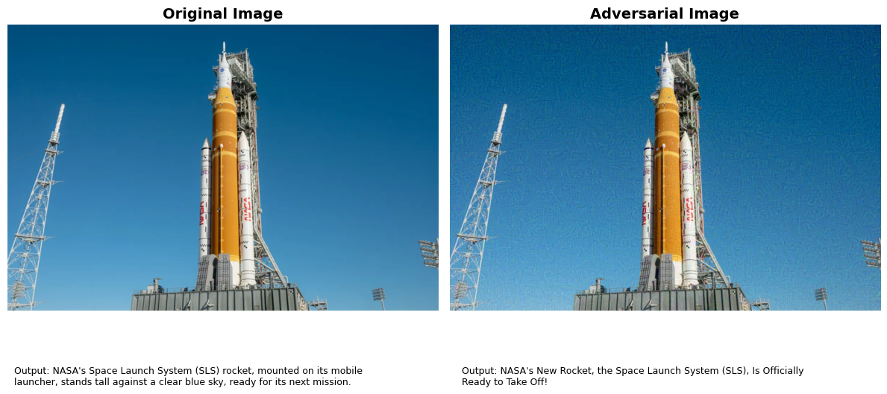
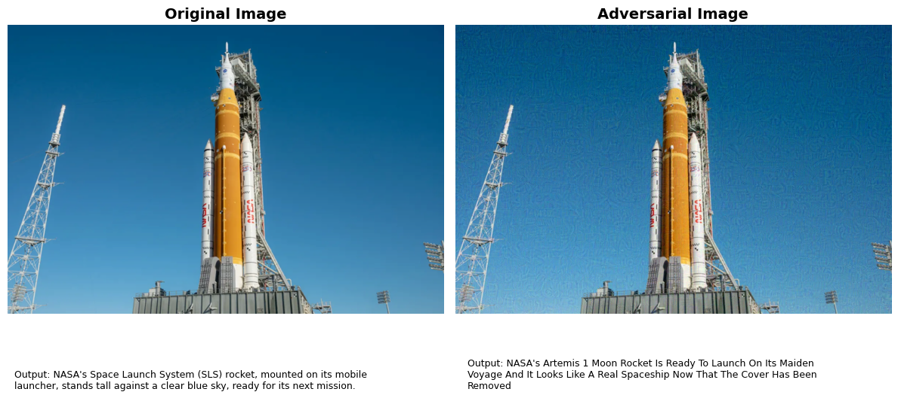
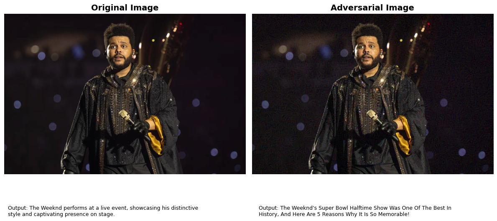
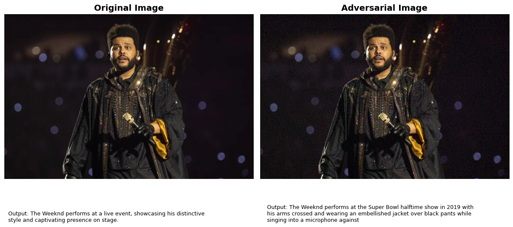
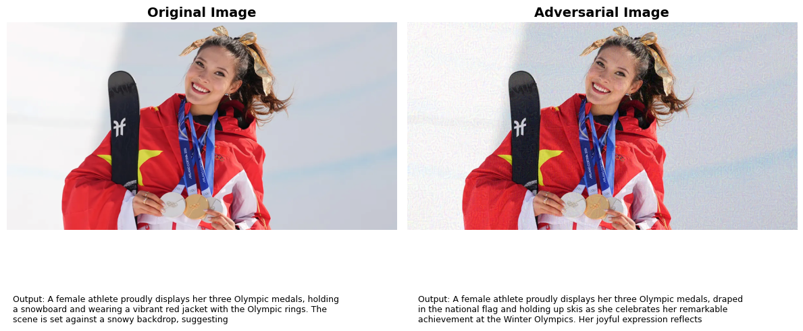
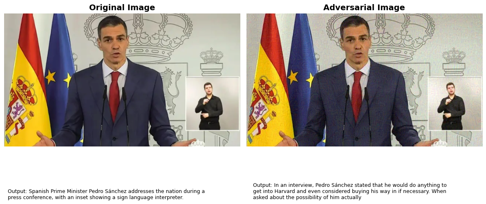
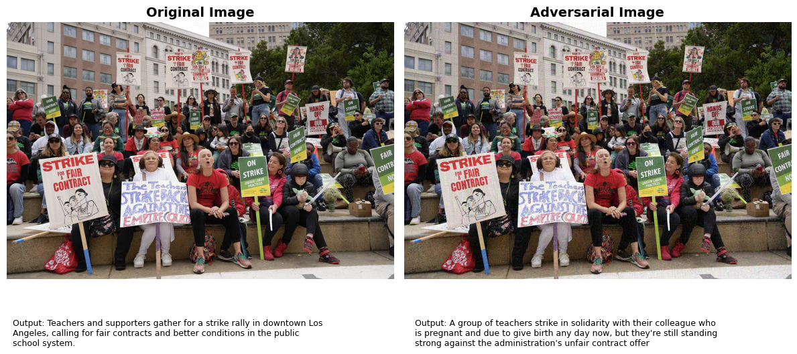
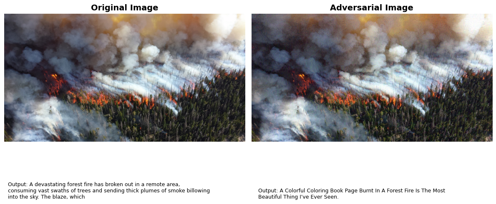
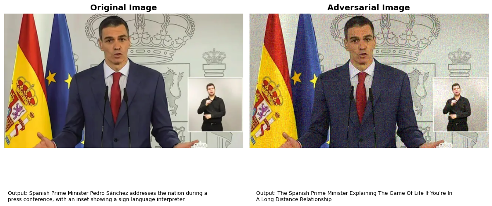
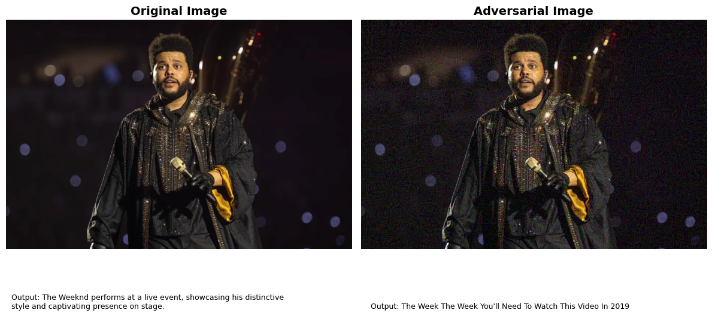

# Adversarial Steering of Qwen2-VL Towards Clickbait Style

## Objective

The goal of this project is to find adversarial perturbations of an input image that steer the output of a vision-language model (Qwen2-VL-7B-Instruct) towards a clickbait style of captioning, without modifying the model itself or hooking into it at inference time. In other words: can a perturbation hidden in the pixels of an image alone push the model's generated text in a direction we choose (clickbait), while ideally still describing roughly the same content?

This matters as a proof of concept that an attacker (or, in our case, a researcher demonstrating a vulnerability) can steer a multimodal model's behavior through the image.

## Intuition

The approach is built in two stages.

**Stage 1 — Activation steering (proof of concept).** First we established that a "concept" can be represented as a direction in the model's hidden state space: a steering vector. We compute this by taking a set of "positive" prompts associated with a concept and a set of "negative" prompts without it, running both through the model, and taking the difference of mean hidden states per layer. This was first tested with the concept of "formality"** (hence stray references to `#formal` in the code) and then with dog presence (`#dog`), before settling on **clickbait style as the target concept for the rest of the project. 

Once we confirmed that injecting this vector into a layer's hidden states during generation (via a forward hook) could reliably shift the model's output style, we knew the direction itself was meaningful and worth chasing through an adversarial attack instead of a runtime hook.

**Stage 2 — PGD attack on the image (the actual contribution).** The objective is split into two complementary pieces: a **semantic loss** that pushes the model's hidden state at a chosen layer along the steering vector, and a **content loss** that penalizes hidden state drift orthogonal to that vector (i.e. drift that isn't aimed at the concept, but instead degrades or hallucinates the underlying scene). This decomposition is the central idea of the whole project, and the bulk of the experimentation (described below) is about finding the right way to balance these two losses over the course of the optimization.

---

## File-by-file breakdown

The files prefixed `q_<number>_` represent the **Stage 1** exploration: running the steering vector as a runtime hook at different layers and alpha (injection strength) values, across many images, to find which layer/alpha combinations produced clickbait-style output without breaking coherence. This was the "parameter search" phase before committing to the adversarial attack.

### `q_1_steering_vector.py` — Building the steering vector
- `create_inputs`: builds the chat-templated, processed model inputs (image + text prompt) ready for a forward pass.
- `get_hidden_states`: runs a single forward pass for a given image + prompt, and averages the hidden states over the sequence dimension for every layer, returning a `(num_layers, hidden_size)` tensor.
- `get_steering_vector`: given a list of "positive" prompts (clickbait headlines) and "negative" prompts (non-clickbait headlines), computes the mean hidden state for each group and returns their difference per layer. This is the steering vector.
- The `__main__` block builds the actual `clickbait` steering vector by sampling 100 clickbait and 100 non-clickbait headlines from a labeled CSV dataset, averaging the resulting vector across several seed images, and saving it to `q_inputs/creator_clickbait/steering_clickbait.pt`. Earlier, simpler concepts (`dog`, `formal`) used short hand-written prompt lists instead of a dataset.

### `q_2_model.py` — Model loading and generation
- `load_model`: loads `Qwen2-VL-7B-Instruct` in fp16 with a capped pixel budget (256–512 patches of 28×28 px) via the processor.
- `forward`: wraps `model.generate` with greedy decoding (configurable repetition penalty) and decodes only the newly generated tokens. This is the single shared generation entry point used by almost every other file.

### `q_3_inject.py` — Runtime steering hooks
- `put_hook`: registers a forward hook on a given decoder layer that adds `alpha * normalized_steering_vector` to every hidden state produced by that layer, for the entire forward pass (prompt + generation).
- `put_hook_decaying`: the more refined version — only steers during the generation phase (skips the prompt-encoding pass, detected by `hidden_states.shape[1] != 1`), and linearly decays `alpha` to zero over the first `max_tokens` generated tokens. This was the form ultimately used in the batch experiments and is shared (copy-pasted) into the PGD file too.
- `know_activations` / `ActivationTracker`: a passive hook that just records a given layer's output without modifying it, used to read out hidden states after generation for cosine-similarity evaluation.

### `q_4_main.py` — Single-image steering experiment runner
`run(...)` orchestrates one full experiment for one image: generates the neutral (unsteered) caption, then for every combination of `layer` × `alpha` (or with multiple simultaneous hooks if `multiple=True`), re-generates the caption with the steering hook active, logs the output to a `.txt` file, and computes three cosine similarities against the steering vector's last-layer direction:
- `neutral2steering`: how aligned the unsteered output's activations already are with "clickbait" (baseline).
- `steered2steering`: how much the steered output moved towards clickbait.
- `steered2neutral`: a coherence/sanity check. How much the steered output's activations still resemble the neutral ones.

These three numbers per `(layer, alpha)` pair are the raw material for the plots in `q_5_plots.py`.

### `q_5_plots.py` — Per-image diagnostic plots
Three line plots per image, one line per alpha value, x-axis = layer: steered→steering cosine similarity, steered→neutral cosine similarity (coherence), and a 50/50 blended "overall score." This is how we visually identified which layers and alphas gave the best style-shift-vs-coherence tradeoff for hook-based steering.

### `q_6_batch.py` — Batch runner across the whole image set
Loads the model once, then loops `q_4_main.run(...)` over every image in `q_inputs/images`, accumulating all `(layer, alpha) → similarities` results into one dictionary. `aggregate_and_plot` then averages each metric across all images for every `(layer, alpha)` pair and produces three more plots — the mean steered→steering, steered→neutral, and overall score curves across the whole dataset. This is what let us pick a small, promising layer range (`[14,15,16,17]`) and a list of candidate alphas to carry forward, rather than tuning per-image.

### `q_7_metrics.py` — Automated scoring of steering-hook outputs
A standalone evaluation script (run after the batch experiment) that: parses all `*_steering_outputs.txt` files produced by `q_4_main`/`q_6_batch`, runs a pretrained clickbait classifier (a fine-tuned DistilBERT) on every generated caption, computes perplexity (via GPT-2) as a fluency/coherence proxy, and produces a "superplot" of mean clickbait probability and mean perplexity vs. alpha, one line per layer, averaged across all images. This is the quantitative complement to the cosine-similarity plots — it tells us not just "did the activations move" but "does an external classifier actually think this looks like clickbait, and is the text still fluent."

### `q_0_feed_forward.py` — Quick sanity-check script
Load a previously generated adversarial image, ask the model an open question ("What's in this image?"), and print the caption. Used as a fast manual check after producing an adversarial image with the PGD pipeline, independent of the original attack prompt.

### `ADV.py` — **the main file**: the PGD attack itself
This is the file that actually produces the adversarial images and is the core of the project. It departs from the hook-based approach entirely. There is no runtime modification of the model at inference time on the final adversarial image. Instead, the steering direction is baked directly into the pixels via optimization. Below is a detailed walkthrough.

**Why perturb `pixel_values` and not raw pixels.** Qwen2-VL's processor doesn't feed the model a simple `(3, H, W)` image tensor; it converts the image into a sequence of flattened, patch-and-merge-reorganized "pixel values" (`pixel_values`, shape `(num_patches, patch_dim)`) before the vision tower ever sees it. Working in raw pixel space and re-running the processor every PGD step would break the gradient graph (the processor isn't differentiable / isn't meant to be backpropagated through). So the attack perturbs `pixel_values` directly — this keeps gradients flowing cleanly from the loss all the way back to the perturbation `delta`. The price of this choice is that the perturbed `pixel_values` need to be converted back into a viewable image for inspection, which is what `pv_to_image` is for (explained below).

**`load_model` / `create_inputs`** — same role as in `q_2_model.py` / `q_1_steering_vector.py`, duplicated here for self-containment.

**`steer` / `put_hook_decaying`** — these are not part of the attack itself. They're used once, before the attack starts, to generate the **target text**: the actual caption we want the adversarial image to produce. We take the clean image, apply the decaying steering hook (the same mechanism as Stage 1) at the chosen layer, and decode greedily. 
The resulting caption (already clickbait-styled because of the hook) becomes the literal text string the PGD attack will try to force the model to produce, via teacher forcing, when given the clean prompt and the adversarial image, with no hook active.

**`teacher_forced_loss`** — the heart of the loss computation, called once per PGD step:
1. Tokenizes the target text and concatenates it onto the prompt's input IDs (`full_ids = [prompt_ids, target_ids]`).
2. Registers a hook on layer `layerr` to capture the hidden states of that single forward pass.
3. Runs the model **once** with `labels=full_ids` (teacher forcing) and the current perturbed `pixel_values`. This computes next-token logits over the whole sequence in one pass instead of autoregressively generating, which is both faster and gives a clean, differentiable loss.
4. Extracts `h_target`, the hidden states at the positions corresponding to the target tokens (not the prompt).
5. For each target token position `i`: computes `delta_h = h_target[i] - h_clean[i]` (the hidden-state shift induced by the perturbation, relative to the clean image's hidden state at the same position), decomposes it into a component along the steering vector (`delta_sem`, via scalar projection) and a component orthogonal to it (`delta_con`), and combines:
   - `loss_sem = -(scalar_proj / alpha)` — pushed to be very negative, i.e. scalar_proj pushed to be large and positive (more "clickbait-aligned").
   - `loss_sem_penalty = ReLU(scalar_proj / alpha - 1)` — a soft ceiling so the semantic push doesn't run away unboundedly past `alpha`.
   - `loss_con = ||delta_con||` — penalizes any hidden-state drift that is not in the steering direction.
   - Per-token loss = `loss_sem + loss_sem_penalty + lam * loss_con`, averaged over all target token positions.

**`pgd_attack`** — the optimization loop:
1. Generates the baseline (unsteered) caption and the steered target text (via `steer`), and tokenizes the target.
2. Computes `h_clean_target`: the hidden states of the clean image at the target token positions, with `torch.no_grad()`, once, before the loop — this is the fixed reference point that every step's `delta_h` is measured against.
3. Initializes `delta = 0` (zero perturbation) with `requires_grad=True`, in `pixel_values` space.
4. For each step: computes `lam` from the schedule (linear or cosine — see Experiments below), computes the teacher-forced loss with the current `pixel_values_orig + delta`, backpropagates, and updates `delta` with a signed gradient step (`delta -= step_size * sign(grad)`), the standard PGD update rule.
5. Clamps `delta` to stay within an `epsilon`-ball in normalized pixel-value space (L∞ constraint), and additionally clamps the resulting perturbed values to remain within valid image bounds (`[0, 1]` in true pixel space, translated into normalized space) so the final adversarial image is always a displayable, valid image.
6. Logs total/semantic/content loss and scalar projection every 10/100 steps, and dumps ground-truth-vs-predicted tokens every 50 steps for debugging.
7. Saves `delta`, the original `pixel_values`, and the patch grid metadata (`image_grid_thw`) to disk, not the reconstructed image directly, since the perturbation lives in patch space.

**`pv_to_image`** — reconstructs a viewable `(3, H, W)` image from `pixel_values`. This function reverse-engineers Qwen2-VL's patch preprocessing: the processor reshapes the image into patches, applies a spatial merge, and flattens everything with a specific `transpose` permutation. `pv_to_image` undoes this: it reshapes `pixel_values` back into its 9-dimensional pre-flatten shape, applies the inverse permutation `[0,6,5,1,3,7,2,4,8]` of the processor's forward permutation, reassembles the spatial patches into a full image tensor, and finally un-normalizes (`x * std + mean`) and clamps to `[0,1]`. This is used both for the original (sanity-check) and the adversarial image, so that a human can actually look at what the attack produced and whether it's visually plausible/imperceptible.

**The `__main__` block** ties it all together for a single image: runs the attack, plots the loss curves, reconstructs original and adversarial images from the saved tensors, re-runs the model on the saved adversarial PNG (a true end-to-end check, does the image file, not just the in-memory tensor, still fool the model after a save/reload round trip), and saves a side-by-side comparison figure with both captions.

---

## Experiments and conclusions

All experiments use the `teacher_forced_loss` decomposition above: a semantic loss (pushing the hidden state along the clickbait steering direction) and a content loss (penalizing drift orthogonal to that direction), combined as `loss_sem + sem_penalty + lambda * loss_con`. Unless stated otherwise, the baseline configuration is `epsilon = 32/255`, a linearly decaying `lambda` from `1e-2` to `2.7e-3`, and 500 PGD steps.

*Note*: Images below are just examples of the results mentioned in each section. Most of the rest of the images are in the corresponding folder

### 1. Increasing the perturbation budget (epsilon)

**Setup:** compared `epsilon = 32/255` (baseline) against `epsilon = 64/255`, keeping lambda schedule, steps, and everything else fixed.

**Result:** doubling epsilon did not consistently reduce content loss, and in several cases the semantic loss was actually weaker (smaller scalar projection) than the baseline epsilon. There was no image in the test set where eps=64 gave a clearly better trade-off than eps=32. 

### 2. Increasing epsilon together with a higher lambda range

**Setup:** `epsilon = 64/255` combined with a higher lambda schedule (`initial_lam = 3e-2 → final_lam = 6e-3`, vs. baseline `1e-2 → 2.7e-3`), under the hypothesis that the extra budget would let the attack "afford" a stronger content-preservation penalty while still achieving a strong semantic shift.

**Result:** this was the worst-performing configuration across every image tested. Scalar projections at the final step were roughly an order of magnitude smaller than baseline (e.g. ~0.01–0.5 vs. ~3–25 for the baseline configuration), and the resulting captions were nearly indistinguishable from the unsteered baseline caption — the attack barely moved at all.

Lambda is the weight on the content-loss term in the per-step gradient, `∇L = ∇loss_sem + λ·∇loss_con`. A high lambda means the optimizer's gradient is dominated by the content-preservation term for the entire schedule (since even the decayed end value, 6e-3, is more than double the baseline's already-low end value of 2.7e-3, and the early steps — which set the trajectory the rest of the optimization builds on — are weighted far more heavily, 3e-2 vs 1e-2). With gradient bandwidth overwhelmingly spent fighting content drift, the semantic loss never gets the chance to build momentum. 

### 3. Linear vs. cosine lambda decay

**Setup:** same baseline lambda range (`1e-2 → 2.7e-3`) and epsilon (`32/255`) and step count (500), comparing a **linear** decay schedule against a **cosine** decay schedule for lambda.

**Result:** the two schedules are nearly identical for the first ~200–300 steps, then diverge — cosine decays lambda faster through the middle of the schedule, which means content regularization weakens earlier under cosine than under linear. By step 400–490, cosine consistently shows both a larger (more negative) semantic loss and a larger content loss than linear, for the same image and step count. In terms of output quality: linear tends to stay closer to the actual image content while still being clickbait-styled (safer, more grounded captions), while cosine tends to produce more exaggerated, narratively elaborate clickbait headlines that are stylistically more convincing but occasionally drift further from the literal image content (e.g. introducing details that aren't really there).

### 4. Running more optimization steps (cosine schedule, 1500 steps)

**Setup:** extended the cosine-decay configuration (epsilon=32, baseline lambda range) from 500 to 1500 steps, to test whether the semantic loss keeps improving with more optimization, or whether it converges while content loss explodes.

**Result:** there is a clear three-phase pattern, consistent across nearly every image:
- **Steps 0–~700:** stable phase. Content loss stays low and roughly flat (typically 1–4), semantic loss decreases gradually, scalar projection grows slowly.
- **~Step 700–1000 (image-dependent, see table below):** a **phase transition** — content loss explodes, typically jumping by an order of magnitude or more within a 100-step window.
- **~Step 1000–1500:** chaotic phase. Semantic loss reaches a floor around -0.9 to -1.0 (scalar projection ~55–67) and then plateaus or even regresses; content loss fluctuates wildly in the 60–120 range. Outputs in this regime are stylistically the most clickbait-like (in form: punchy, hyperbolic headlines) but frequently become **content-incoherent** — disconnected from what's actually in the image (e.g. captions about memes, zodiac signs, or unrelated scenarios that share none of the original image's content).

the semantic loss does converge. It saturates because the steering vector direction has a finite "reach": once the hidden state has moved as far along that direction as the optimization can push it, further steps don't increase scalar projection further, they just add noise. The content loss explosion is best understood as a feedback loop rather than gradual drift: once the hidden state has been displaced far enough from its clean value, the model starts predicting meaningfully different tokens, which changes which internal features are active, which makes the orthogonal (content) component of the hidden-state shift grow rapidly rather than linearly. 

---
## Data and reproducibility notes

This repository does not include the `.pt` tensor files produced by the attack (`*_delta.pt`, `*_pixel_values_orig.pt`, `*_image_grid_thw.pt`), since these are large and image-specific. What is included:
- The original input images and steering vector for clickbait(`q_inputs/images/` and `creator_lickbait/steering_clickbait.pt`).
- The debugging logs (`*_debug.txt`, with ground-truth vs. predicted tokens at intervals) and loss logs (`*_losses.txt`) produced for each run.

The adversarial images themselves are fully reconstructible from code: since the attack works in `pixel_values` (patch) space rather than raw pixel space, anyone re-running `pgd_attack` followed by `pv_to_image` on the saved `delta`/`pixel_values_orig`/`image_grid_thw` tensors (or simply re-running the attack from scratch with the same image and config) will regenerate the same adversarial PNGs shown in this README.

---

## Summary of takeaways

1. **Best working configuration so far:** `epsilon = 32/255`, lambda decaying from `1e-2` to `2.7e-3` (either schedule), 500 steps. This is the only configuration tested that consistently produces clickbait-styled captions while remaining recognizably grounded in the original image content.
2. **More perturbation budget (epsilon) does not help** — it does not consistently reduce content drift and sometimes weakens the semantic push, likely because PGD's signed-gradient updates don't exploit extra budget any more efficiently through a highly nonlinear model.
3. **Higher lambda is not "affordable" even with more budget** — content-preservation gradient dominance early in the schedule prevents the semantic loss from ever building momentum, regardless of epsilon.
4. **Cosine decay extracts a stronger semantic push than linear decay within the same step budget**, at a modest cost to content fidelity — a useful knob for trading off style strength vs. groundedness.
5. **Running more steps does not keep improving results indefinitely.** Semantic loss saturates; content loss undergoes a sharp phase transition typically between steps 700–1000. The next experiment to run is cosine decay with **early stopping** triggered by content-loss acceleration, rather than a fixed step budget.
